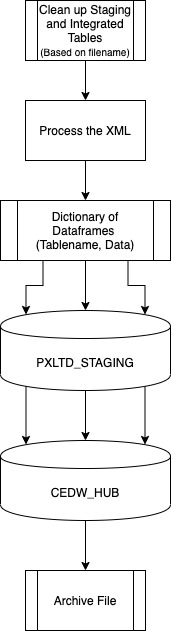
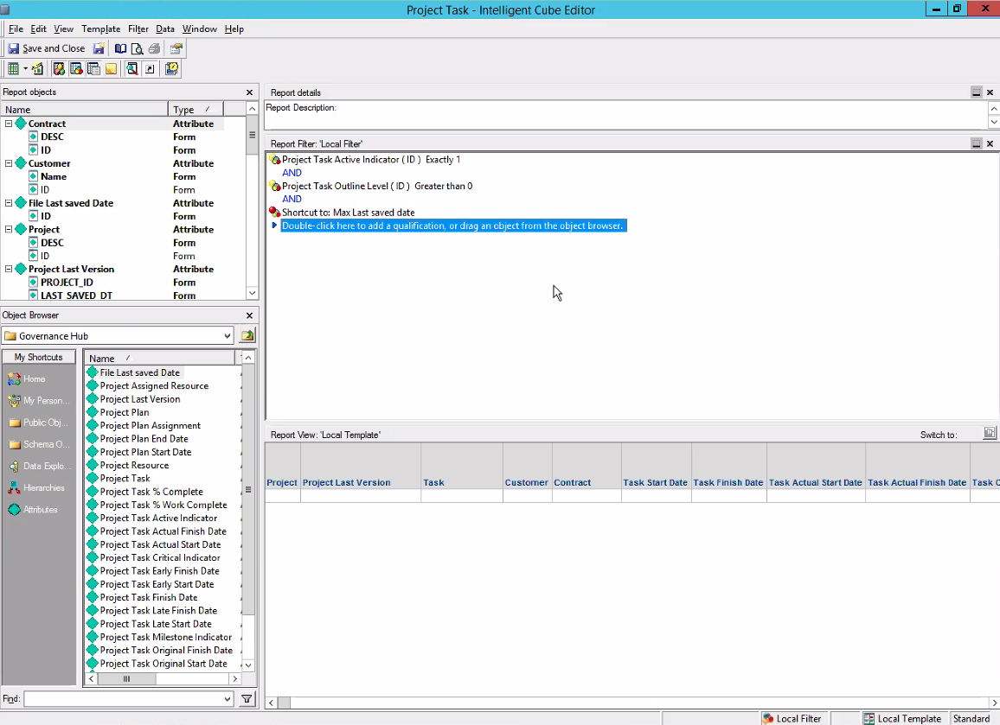

# Governance Hub Project Upload

---

## Project Overview

The Governance Hub Project Upload is a python data ingestion pipeline that processes MS or SG Project XML Files from a local directory on server and lands them to a staging database and then into production database.

---

## Tech Stack


* Python 3.6
* Microsoft SQL Server

A quick snapshot of all the python libraries currently in production environment.

awscli==1.18.66
boto3==1.9.93
botocore==1.12.253
certifi==2018.1.18
cffi==1.14.0
chardet==3.0.4
Click==7.0
colorama==0.4.3
cryptography==2.9.2
DateTime==4.3
defusedxml==0.6.0
docutils==0.14
et-xmlfile==1.0.1
Flask==1.1.1
idna==2.6
itsdangerous==1.1.0
jdcal==1.4.1
Jinja2==2.11.1
jira==2.0.0
jmespath==0.9.3
MarkupSafe==1.1.1
numpy==1.16.0
oauthlib==3.1.0
openpyxl==3.0.3
pandas==1.0.3
pbr==5.4.5
pyasn1==0.4.8
pycparser==2.20
PyJWT==1.7.1
pyodbc==4.0.27
python-dateutil==2.7.5
pytz==2018.9
PyYAML==5.3.1
requests==2.18.4
requests-oauthlib==1.3.0
requests-toolbelt==0.9.1
rsa==3.4.2
s3transfer==0.2.1
six==1.12.0
slackclient==1.3.0
slacker==0.14.0
SQLAlchemy==1.2.17
unicodecsv==0.14.1
urllib3==1.22
websocket-client==0.54.0
Werkzeug==1.0.0
xlrd==1.2.0
zope.interface==4.7.1

---
## Application Process Flow

---



## Code Structure


`\config` folder contains connection details for python to connect to SQL Server and XML to Staging Table mapping.

`\sample Data` contains sample files that were used in development as reference

`\sql` contains sql files used to either to 
1. Clean up Staging and Integrated Tables
2. Update Unique / Foreign keys in the Staging Tables
3. Move Staging data into Integrated Tables

`\src` contains source python code. 
1. `dbUtil.py` contains the database connection object
2. `project_upload_helper.py` is a helper file
3. `project_upload_process.py` contains the application flow logic

---
## Setup


This project can be placed anywhere on the server but should be noted for the future


Project Path: `C:\govhub_ms_sg_upload`

Logging Path: `D:\ETL_Logs\GovHub_Project_Upload`

---
## Deployment (Manual and Unscheduled)


Depending on the `<path\to\directory\govhub_ms_sg_upload>`,
a manual invocation can be is performed by issuing on MS Powershell 

````bash
cd <path\to\directory\govhub_ms_sg_upload>
python .\src\project_upload_process.py
````

---
## Business Rules


### Filename rules


````
MS_PRXXXXXX_VV_YYYYMMDD.xml
SG_PRXXXXXX_VV_YYYYMMDD.xml
````

where 
* _XXXXXX_ denotes the Project ID
* _VV_ denotes the version number of the document
* YYYYMMDD denotes the year month day of the document

### Data

  **It is assumed that if a file with the exact filename is placed on OneDrive more than once, it is the more up to date version and will replace data within the staging and integrated tables.**

### MicroStrategy Rules




### Connections 

#### Ingestion Folder

`D:\Project X Ltd\Project X - DBX_Upload\Gov_Hub\Project_Upload`

#### Archival Folder

`D:\Project X Ltd\Project X - DBX_Upload\Gov_Hub\Project_Archive`

#### Database Connections

Please see `\configs\ConnectionData.json`

#### Data Mapping Quick Glance

| Source Database | Source Table                               | Target Database | Target Table                                 | Transformation                                              |
|-----------------|--------------------------------------------|-----------------|----------------------------------------------|-------------------------------------------------------------|
| PXLTD_STAGING   | Ms_Project_Header_Xml                      | CEDW_HUB        | Project_Plan_Header_WTF                      | substring function to parse out PRXXXXXX                    |
| PXLTD_STAGING   | Ms_Project_Task_Xml                        | CEDW_HUB        | Project_Plan_Task_WTF                        |                                                             |
| PXLTD_STAGING   | Ms_Project_Resource_Xml                    | CEDW_HUB        | Project_Plan_Resource_WTF                    |                                                             |
| PXLTD_STAGING   | Ms_Project_Assignment_Xml                  | CEDW_HUB        | Project_Plan_Assignment_WTF                  |                                                             |
| PXLTD_STAGING   | Ms_Project_Calendar_Xml                    | CEDW_HUB        | Project_Plan_Calendar_WTF                    |                                                             |
| PXLTD_STAGING   | Ms_Project_Assignment_Time_Phased_Data_Xml | CEDW_HUB        | Project_Plan_Assignment_Time_Phased_Data_WTF |                                                             |
| PXLTD_STAGING   | Ms_Project_Task_Time_Phased_Data_Xml       | CEDW_HUB        | Project_Plan_Task_Time_Phased_Data_WTF       |                                                             |
| PXLTD_STAGING   | Ms_Project_Calendar_Weekday_Xml            | CEDW_HUB        | Project_Plan_Calendar_Weekday_WTF            |                                                             |
| PXLTD_STAGING   | Ms_Project_Calendar_Weekday_Times_Xml      | CEDW_HUB        | Project_Plan_Calendar_Weekday_WTF            | Joined with base table Weekday to flatten  the time ranges  |
| PXLTD_STAGING   | Ms_Project_Calendar_Exception_Xml          | CEDW_HUB        | Project_Plan_Calendar_Exception_WTF          |                                                             |
| PXLTD_STAGING   | Ms_Project_Calendar_Exception_Times_Xml    | CEDW_HUB        | Project_Plan_Calendar_Exception_WTF          | Joined with base table Exception to flatten the time ranges |
| PXLTD_STAGING   | Ms_Project_Predecessor_Link_Xml            | CEDW_HUB        | Project_Plan_Predecessor_Link_WTF            |                                                             |

---

## Useful Context 

1. In branch dev under commit `04f3c8be4a52d5e3c2386abc131e2410554f4dbc`, we decided to clone Integrated tables with `Project_Plan_*` and add suffix `_WTF` in order to isolate an unknown process (Talend) from deleting data that we were inserting. 

---

## Troubleshooting 


If the application does not behave in the intended way, (i.e the files are not being processed and archived), logs can be found in this directory. 

Logging Path: `D:\ETL_Logs\GovHub_Project_Upload`

Find the log that contains the file that is not working with the timestamp and logs should be there
